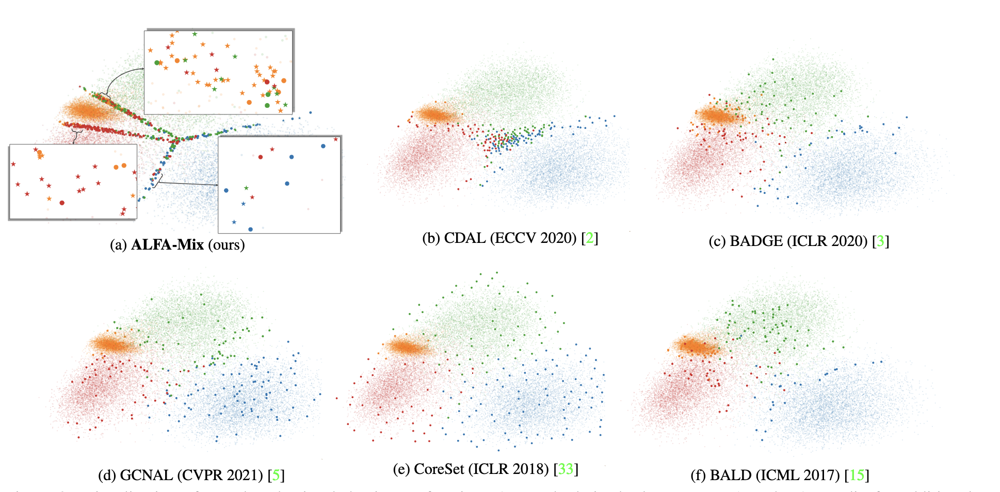
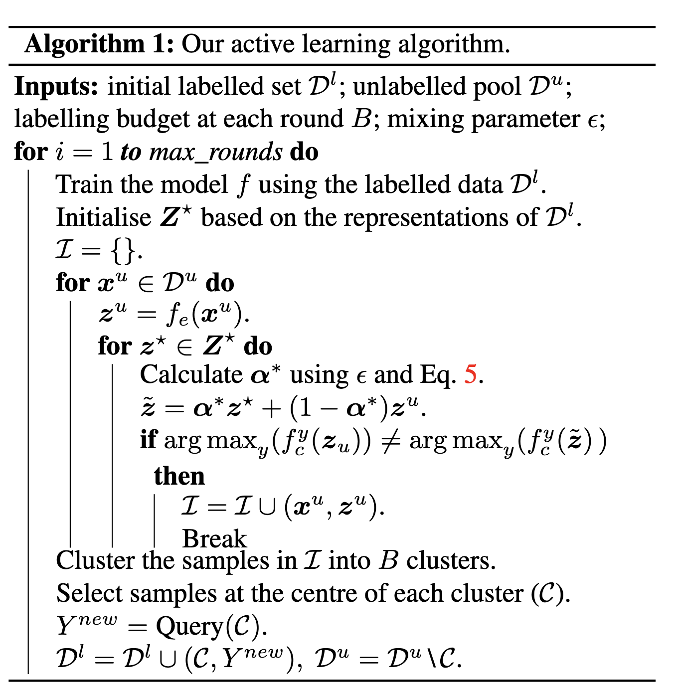

## AIML（University of Adelaide）等
## Codebase: https://github.com/AminParvaneh/alpha_mix_active_learning
## CVPR 2022
## 解决了什么问题？
1. Active Learning的research gap
我们一般的Active Learning的做法一般都是在决策层做文章，但是这篇文章说特征层其实也能去做Active Learning，这样的确是更直观的，也是容易想到的
2. 给了一种新的SOTA方法
这个方法虽然做法和claim有点不符，但是提点是实实在在的，多次复现点数都很高，非常Solid。
## Method
#### 定义下问题：
我们有$\mathcal{D}^l=\{(\boldsymbol{x}_i,y_i)\}_{i=0}^M$作为我们的数据集，我们训练一个$f=f_c\odot f_e$这样的神经网络去做分类，那么他们的参数分别是$\boldsymbol{\theta}=\{\boldsymbol{\theta}_e,\boldsymbol{\theta}_c\}$，其中特征提取网络$f_e:\mathcal{X}\to\mathbb{R}^D$，分类层$f_c:\mathbb{R}^D\to\mathbb{R}^K$,然后*Softmax*成概率向量$p(y\mid\boldsymbol{z};\boldsymbol{\theta})=\operatorname{softmax}(f_c(\boldsymbol{z};\boldsymbol{\theta}_c))$，然后我们最小化这个Loss：$\mathbb{E}_{(\boldsymbol{x},y)\thicksim\mathcal{D}^l}[\ell(f_c\odot f_e(\boldsymbol{x};\boldsymbol{\theta}),y)]$，同样我们也会有一个预测的伪标签：$y_{\boldsymbol{z}}^*=\arg\max_yf_c^y(\boldsymbol{z};\boldsymbol{\theta}_c)$，对于无标签的数据，我们收集他们的所有表征集合：$\boldsymbol{Z}^u=\{f_e(\boldsymbol{x}),\forall\boldsymbol{x}\in\mathcal{D}^u\}$，对于每一个有标注样本，我们收集他们每一个类别的平均表征，生成一个anchor表征集合$\mathbf{Z}^{\star}$
#### 下面讲方法
首先，直观上，这个方法的主要思想就是把这个样本表征，往别的方向进行扰动（插值），然后看看样本是否发生预测转变，如果发生了，说明这个样本的表征处于决策边界，或者说本身的预测不太确定，此时我们要提高选到他的概率。
下面就是比较理论的推导，去推导出我们的插值算法。
我们引入符号$\boldsymbol{\alpha}\in[0,1)^D$，去度量我们每一个维度插值的强度，注意这里是逐维度插值的，所以并非在特征点上进行线性插值。插值是这样的：
$$\boldsymbol{z}\sim p(\boldsymbol{z}\mid\boldsymbol{z}^u,\boldsymbol{Z}^\star,\boldsymbol{\alpha})\equiv\boldsymbol{\alpha}\boldsymbol{z}^\star+(1-\boldsymbol{\alpha})\boldsymbol{z}^u,\boldsymbol{z}^\star\sim\boldsymbol{Z}^\star$$
然后，插值了之后一定会有loss的上升，这里的loss是指Unlabeled的数据的预测概率向量对他预测的伪标签的交叉熵损失，这个插值后的loss我们把他一阶泰勒展开，像这样：
$$\begin{aligned}\ell\left(f_c\left(\tilde{\boldsymbol{z}}_{\boldsymbol{\alpha}}\right),y^*\right)&\approx\ell\left(f_c(\boldsymbol{z}^u),y^*\right)+(\boldsymbol{\alpha}(\boldsymbol{z}^\star-\boldsymbol{z}^u))^\intercal.\nabla_{\boldsymbol{z}^u}\ell\left(f_c\left(\boldsymbol{z}^u\right),y^*\right)\end{aligned}$$
泰勒展开还有一个前提是这个：$\|\alpha\|\leq\epsilon$，也就是这个$\alpha$要小到一定程度，要不然泰勒展开不适用。
那么loss的上升值就是右边那一项了，我们想最大化他就像这样：
$$\begin{aligned}\max_{\boldsymbol{z}^{\star}\boldsymbol{\sim}\boldsymbol{Z}^{\star}}\left[\ell\left(f_{c}\left(\tilde{\boldsymbol{z}}_{\boldsymbol{\alpha}}\right),y^{*}\right)\right]-\ell\left(f_{c}(\boldsymbol{z}^{u}),y^{*}\right)&\approx\max_{\boldsymbol{z}^{\star}\boldsymbol{\sim}\boldsymbol{Z}^{\star}}\left[(\boldsymbol{\alpha}(\boldsymbol{z}^{\star}-\boldsymbol{z}^{u}))^{\intercal}.\nabla_{\boldsymbol{z}^{u}}\ell\left(f_{c}\left(\boldsymbol{z}^{u}\right),y^{*}\right)\right].\end{aligned}$$
下面我就要选择这个$\alpha$的取值了，在保证这个$\alpha$的长度小于$\epsilon$的前提下，目的还是最大化这个loss上升量：
$$\boldsymbol{\alpha}^*=\underset{\|\boldsymbol{\alpha}\|\leq\epsilon}{\operatorname*{\operatorname*{\arg\max}}}(\boldsymbol{\alpha}(\boldsymbol{z}^\star-\boldsymbol{z}^u))^\mathsf{T}.\nabla_{\boldsymbol{z}^u}\ell(f_c(\boldsymbol{z}^u),y^*)$$
这个东西没闭式解，但是优化后就会有，这个地方推导我后面过来补吧，但是总之用底下这个式子算出$\alpha$
$$\boldsymbol{\alpha}^*\approx\epsilon\frac{\|(\boldsymbol{z}^\star-\boldsymbol{z}^u)\|_2\nabla_{\boldsymbol{z}^u}\ell(f_c(\boldsymbol{z}^u),y^*)}{\|\nabla_{\boldsymbol{z}^u}\ell(f_c(\boldsymbol{z}^u),y^*)\|_2}\oslash(\boldsymbol{z}^\star-\boldsymbol{z}^u)$$
其中这个$\mathrm{Ø}$是逐元素除法。
#### 最后这个公式其实如果深入理解的话就会发现问题
令$\mathbf d=\mathbf z^\star-\mathbf z^u.$  则
$$  
\widetilde{\mathbf z} =\boldsymbol\alpha\odot\mathbf z^\star +(\mathbf 1-\boldsymbol\alpha)\odot\mathbf z^u =\mathbf z^u+\boldsymbol\alpha\odot\mathbf d.  
$$

由论文的闭式近似，
$$  
\boldsymbol\alpha^\star \approx \epsilon \frac{\|\mathbf d\|_2\,\nabla_{\mathbf z^u}\mathcal L} {\|\nabla_{\mathbf z^u}\mathcal L\|_2} \oslash\mathbf d.  
$$
那么我们把这个代入上面算插值后特征的式子当中
$$  
\widetilde{\mathbf z} \approx \mathbf z^u+ \epsilon \frac{\|\mathbf d\|_2\,\nabla_{\mathbf z^u}\mathcal L} {\|\nabla_{\mathbf z^u}\mathcal L\|_2},  
$$
可以发现这边控制扰动方向的这个只有L对z的这个梯度，即沿损失关于特征的梯度上升方向进行扰动。
#### 继续说方法，接下来我们最终选样
首先，我们去构造一个候选集：
$$\mathcal{I}=\left\{\boldsymbol{z}^u\in\boldsymbol{Z}^u|\exists\boldsymbol{z}^\star\in\boldsymbol{Z}^\star,f_c^*(\tilde{\boldsymbol{z}}_{\boldsymbol{\alpha}})\neq y_{\boldsymbol{z}^u}^*\right\}$$
然后我们需要在这个候选集上面去做B簇k-means，去选多样、有代表性的样本。
那么文章也做了Observation，相比其他的AL算法，他可以选到更多决策边界的样本：

那么整个方法的伪代码一张图就可以说清：

