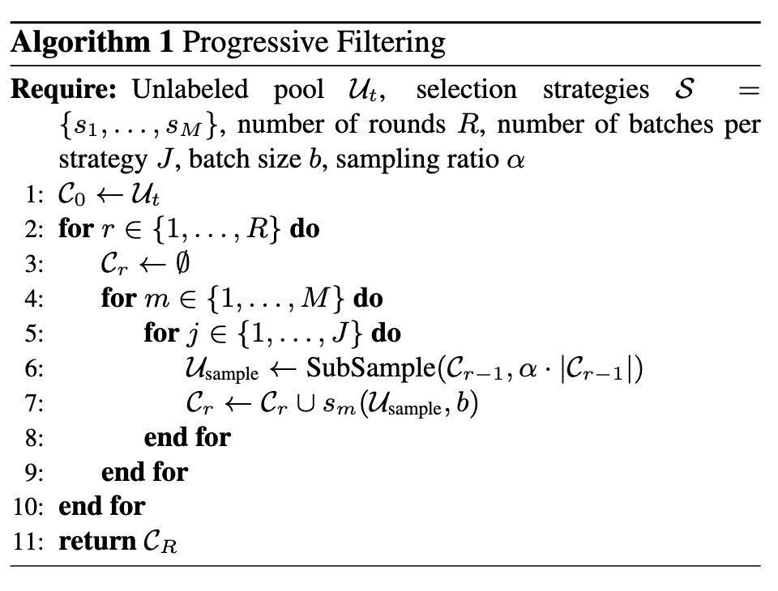

## University of Kassel, Germany（卡塞尔大学）
## CVPR 2026
## Codebase: https://github.com/dhuseljic/dal-toolbox/tree/main/publications/cleaning_the_pool
## 解决了什么问题？
#### 集成式主动学习
传统主动学习策略会出现一些问题，特别是硬规则启发式的策略，固定一个选样规则难以建模现在的模型认知，所以我们一般是这样做的，我们同时运行多个主动学习策略，然后我们去选择性采纳他们各自的意见，然后达成一个最终的选样结果，这个idea是和[AutoAL: Automated Active Learning with Differentiable Query Strategy Search](https://arxiv.org/abs/2208.07734) *(笔记未写完)*类似的，那么他属于是重新训了一个模型，用了一点meta-learning的内容，但是我们是采用了一个逐步分层筛选的一个过程，整个这个选样的过程没怎么用到深度学习相关内容，所以也比较省计算，而且效果很好。
## Method
这个方法真的很简洁，一个伪代码就解决了，说完之后就讲其他的分析去了。
这个Progressive Filtering算法其实很简单的
我们有一个未标注的集合$\mathcal{U}_t$，一个包含很多启发式主动学习算法的集合$\mathcal{S}=\{s_1,\ldots,s_M\}$，然后我们做$R$轮的过滤，然后我们设计一个采样超参$\alpha$，然后就可以运行这个算法了。
定义$\mathcal{C}_0\leftarrow\mathcal{U}_t$，也就是这个初始的大池子是整个未标注集合。
对于每一轮过滤，我们让这一轮的池子初始化为空，然后我们每个AL策略，去对上一轮过滤出来的池子随机划分的子池子（比率是$\alpha$）选B个样本，那么我们把这J乘以M个b个样本并起来，得到这一轮筛选的池子。
#### 第一个问题：为什么能保证这个池子越来越小？
这个是一定的，因为这一轮的所有样本，肯定是出自上一轮池子中的，只要这一轮有一个样本没被任何算法提名过，那么就过滤掉了，所以至少不会多，那么也会越来越小。
#### 第二个问题：什么时候停止
运行完R个round就停止，那么途中会一直保持选样池数量大于b个，如果最后仍大于b个，我们就去运行一个MaxHerding选出b个样本，最后达到选b个样本的目的。
## Analysis
#### 这个文章在方法层面比较简洁，后面的篇幅基本都在写一些分析，我们一点一点说
1. 为什么选择并集而不是交集？
首先，交集在选择策略共识的时候还是比较有价值的，很容易选到在多个策略中都有价值的样本，与此同时带来的问题也有一些：
    1. 容易丢掉特定策略所带来的价值度量，有可能那个策略有一种独特的看样本的视角，你丢掉它，策略的多样性就被丢掉了，集成主动学习就没有价值。
    2. 它也会带来候选池的快速减少，要是策略之间的共识样本很少，那么这个候选池甚至可能凑不够b个样本
2. 为什么设计了这样一个超参数$\alpha$？
这个问题其实很简单，如果把$\alpha$设计成1的话，也就是没有这个随机采样的设计的话，那么每一个主动学习策略这J次的选样都是一模一样的，这个并集就没啥意义了。
3. 理论推导（这个不想看了）