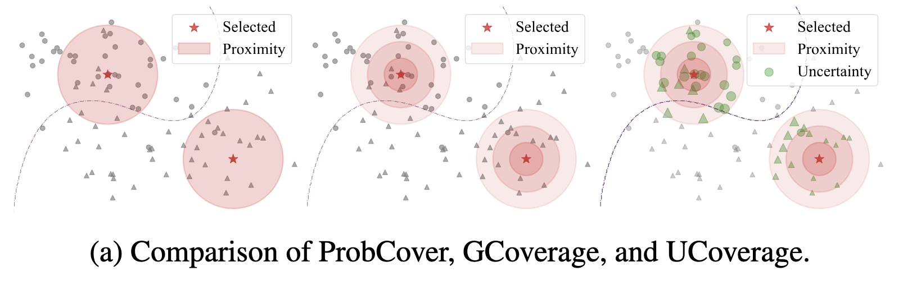
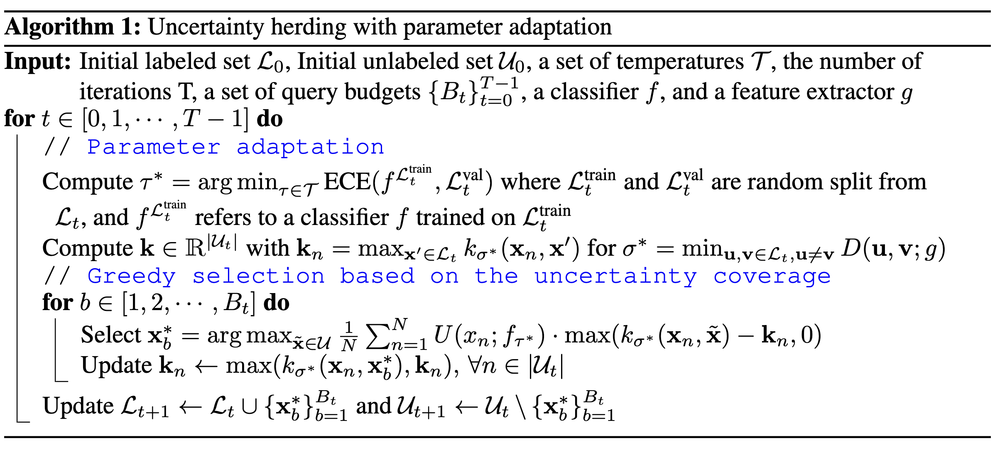

 ## ICLR 2025 
## University of British Columbia & Borealis AI
## Codebase: https://github.com/BorealisAI/uherding
## 解决了什么问题？
#### 主动学习中多样性和不确定性的trade-off问题
这个也很常见了，在高预算场景下，uncertainty-based method一般比较work，在低预算场景下，diversity-based method一般比较work。但是首先这个高预算低预算很难去定义，其次这个在训练过程中这些方法很少去改变策略，所以平常的方法又很难去trade-off在训练前期和后期的策略，所以这个文章提供了一个视角。

可以看看上面这张图，比较了本文的这个UCoverage和其他的区别，相比其他，他使用Kernel Function以更关注该点附近的点，也使用了Uncertainty保证覆盖到了不确定性更大的区域。
## Methods
1. 文章开头就给出了一个定义，也是我们选样的一个核心标准
$$\mathrm{UC}_{k_\sigma}(\mathcal{S})=\mathbb{E}_\mathbf{x}\left[U(\mathbf{x};f)\max_{\mathbf{x}^{\prime}\in\mathcal{S}}k_\sigma(\mathbf{x},\mathbf{x}^{\prime};g)\right]\approx\frac{1}{N}\sum_{n=1}^NU(\mathbf{x}_n;f)\max_{\mathbf{x}^{\prime}\in\mathcal{S}}k_\sigma(\mathbf{x}_n,\mathbf{x}^{\prime};g)=\widehat{\mathrm{UC}}_{k_\sigma}(\mathcal{S})$$
这个量怎么算，其实就是针对每一个样本$\mathbf{x}^{\prime}$，我们算一个与其他$n$个点的距离，这个距离使用了一个kernel function，比如说RBF kernel.，注意这个特征空间其实是在$\boldsymbol{g}(\mathbf{x})$上的，也就是说这个特征空间其实并不是分类器学出来的那个特征，而是用一些自监督算法去在整个数据集上学出来的。那么我们这个数据集上面的UC值，其实就是对于每一个未标注的样本，找到已标注的样本中与他kernel function最大的那个kernel值，以表示他被cover的多好，然后与他的U去加权和，算出来的这个数。
2. 可以看到这里面的$\sigma$是一个超参数，这个超参数是怎么设定的？这个值其实是用在kernel function里面的，这个值如果很小，这个UC会退化成纯Uncertainty选样本，我们希望他在选样本前期保持大，后期变成小，就可以退化为Ucertainty-Select了。那么我们具体操作的时候，这个$\sigma$我们会给他设计为label set中距离最短的那个距离。
3. 其实这个Uncertainty里面也会有一个超参数，可以理解为这个softmax的时候的温度参数$\mathcal{T}^{*}$啊，那么这个温度参数越大，表示我们的表示这个我们的这个分类概率越没有区分度，差得越少，那么我们uncertaintuncertainty越大，越占主导，反之则是核函数的那一项占主导。那么我们这个温度参数怎么调呢，其实很简单，我们希望这个Uncertainty这一项量化的是真实的错误率，所以我们调整这个温度系数，以最小化这个ECE。ECE是这样算的：
$$\mathrm{ECE}(f,\mathcal{D})=\frac{1}{|\mathcal{D}|}\sum_{m=1}^{M}|B_{m}|\cdot|\mathrm{Acc}(B_{m},f)-\mathrm{Conf}(B_{m},f)|$$
也就是真实的Acc-置信度，最小化这个，实现时候要做个按置信度分桶，把每个桶的这个数值求个平均，要分桶的原因是因为Acc是个统计量，不能逐样本计算。
4. 那么其实这个我们怎么去选一个S其实是一个需要遍历的NP难问题对吧，因为不同的组合他的cover肯定是没有一些性质让我们去减少这个选样的时间复杂度的，但是这里作者采用的是贪心算法，也就是直接选B次样本，第一次随机选入一个，第二次选入在整个Unlabeled集合里面能够让UC提升最大的样本，这样循环B次就能选出一个次优的集合了。
这个选样本的具体实现大概是这样的：

中文讲解一下吧：
先预训练一个自监督出来的特征提取网络g
对于每一个选样周期中，先去把超参数温度系数$\mathcal{T}^{*}$算出来，然后计算一个逐样本之间的核函数，然后把$\sigma$找出来，我们就可以去用贪心去选样本了
这个循环经过B次，首先算一个$k_{\sigma^*}(\mathbf{x}_n,\tilde{\mathbf{x}})-\mathbf{k}_n$，表示选到这个样本能够增加哪些样本的cover值，然后乘以这些样本的Uncertainty，我们选使得这个值最大的样本，如此循环B次结束
## Takeaways
这个idea和我想的那个idea好像啊，我是用attention embedding去选样的，他这里和我的kernel function都用的一样，但是他用的另一种视角，我觉得可以和mnp那个文章结合一下，很有希望。