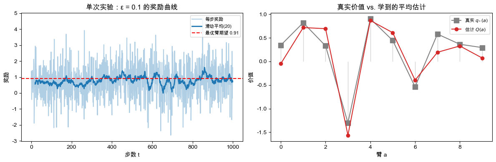
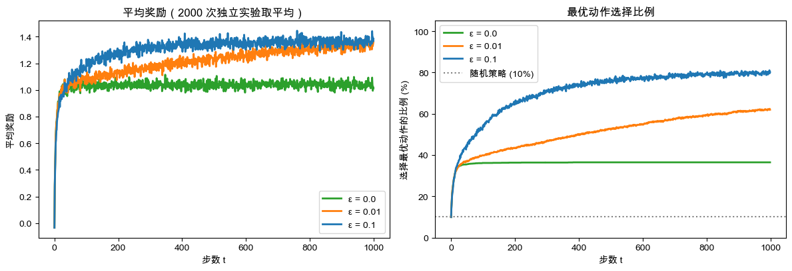
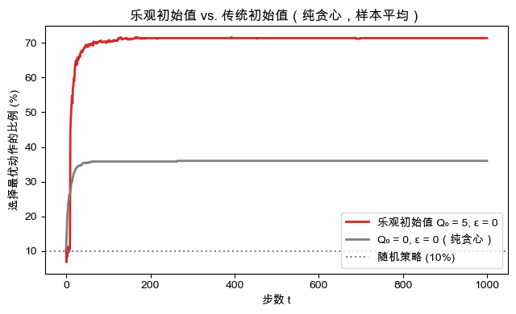
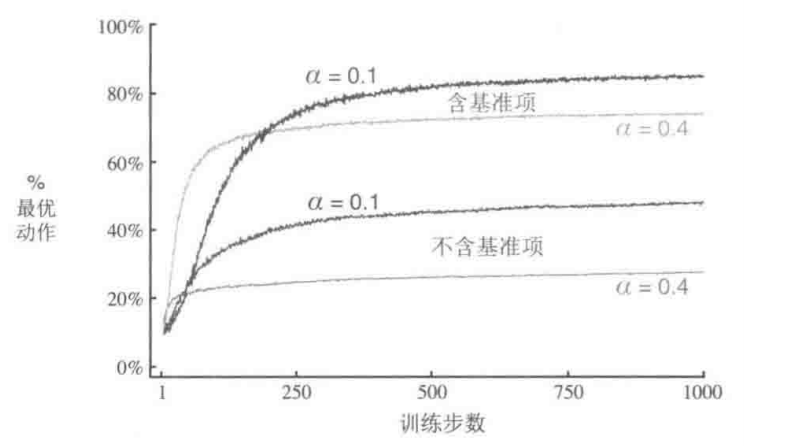

## 2.1 k臂老虎机
1. 问题陈述
一个人面对$k$个选项，也就是$k$个老虎机的拉杆，每次可以任选一个，选完一个之后，这个老虎机就会给出对应选项的金币，那么每一个选项给出的金币是服从一个独立的概率分布的，有独立的期望和方差。我们的目标是在一定时间步内最大化总收益的期望。
2. 符号定义
在这个问题当中，其实我们很显然是没有状态的，对吧，也就是说我们的状态空间始终是那一个，不会发生状态的转换。那我们每一个动作都会给我们带来收益对吧，也就是这个老虎机给我们吐出来的金币，我们在一个与老虎机交互的轨迹中，把步数的序号记作$t$，那么$t$时刻的动作我们记作$A_t$，那么这个时刻做任何一个动作，一定会有一个收益，这个收益也是一个与动作有关的随机变量，我们暂且记作$R_t$，那如果我们把动作固定下来，那么这个就是一个自由的随机变量了对吧。那么我们希望拿到这个动作的期望收益，我们就这样定义：$$q_*(a)\doteq\mathbb{E}[R_t\mid A_t=a]$$如果我们有这个数值，这个任务就直接选$k$个拉杆中期望收益最大的就结束了。
当然我们拿不到这个期望的真值，但是我们可以在交互过程中去估计这个数值，比如说用多次采取该动作的收益平均出来。
那么我们再定义一个量$Q_{t}(a)$，这个其实就是对$q_*(a)$真值的估计，这个是带一个时间$t$的脚标的，是因为我们对某一个动作期望收益的估计，是会随着交互不断变化的。
3. 下面我们讲一下如何估计这个值
我们去估计每一个动作的期望收益的时候，对于每一个$Q_t(a)$，我们同一时刻，总有一个action的估计收益是最高的，我们完全可以***贪心***的去选这个估计值最高的动作，当然可能还有更高期望收益的动作我们没发现，所以我们也可以***试探***地去选取其他非最高的动作，那么总结下来，这一个试探与开发互相trade-off的问题。
接下来将会介绍一些去trade-off这两个决策的方法
## 2.2 Actor-Critic Method（动作-价值方法）
在这里，这个方法就是我之前说的去用平均估计期望收益的方法，和DRL里面不算很一样，但是思想一样。$$Q_{t}(a)\overset{.}{=}\frac{t\text{ 时刻前通过执行动作 }a\text{ 得到的收益总和}}{t\text{ 时刻前执行动作 }a\text{ 的次数}}=\frac{\sum_{i=1}^{t-1}R_{i}\cdot\mathbb{1}_{A_{i}=a}}{\sum_{i=1}^{t-1}\mathbb{1}_{A_{i}=a}}$$其中如果我们之前没选过某个动作的话，我们会把$Q_t(a)$初始值设置为0
根据大数定律，这个估计值会依概率收敛到真值期望收益
那我们如何根据这个价值估计去指导Agent的行为呢？
第一种是贪心，像这样：$$A_t\doteq\underset{a}{\operatorname*{\operatorname*{\arg\max}}}Q_t(a)$$直接选价值最高的动作，这种方法不会花时间去尝试劣质动作，但是这样蛮不好的呀，因为很容易拿到小收益，探索性可以说基本没有。所以为了改进，我们可以以一个很小的概率$\epsilon$去在非最大估计收益的动作中去做，这种方法叫$\epsilon$-贪心方法，这个方法在无数次的交互之后，能保证去给各个期望收益一个不错的估计，也意味着选择最优动作的概率会收敛到大于$1-\epsilon$。
## 2.3 10臂测试平台
作者做了一个实验（这边我也做了，在RLCode当中可以看到），去分析上面讲的一些贪心算法的有效性，这个时候我就以我做实验的图来讲了
1. 第一步，我先初始化我的10臂老虎机，大概这样做，对于每个臂，我们认为他的价值分布是一个高斯分布，我都从标准正态分布中抽样出它的期望收益$q_*(a)$，然后我们有10个臂那么这就是一个10维数组。至于每一个臂的方差，我们设计为一致的，在这里我们设计为1.0，即：$$R\sim\mathcal{N}(q_*(a),1),\quad q_*(a)\sim\mathcal{N}(0,1)$$
2. 我们这里计算Q值采用第一种实现，也就是直接平均式实现，即$$Q_{t}(a)\overset{.}{=}\frac{t\text{ 时刻前通过执行动作 }a\text{ 得到的收益总和}}{t\text{ 时刻前执行动作 }a\text{ 的次数}}=\frac{\sum_{i=1}^{t-1}R_{i}\cdot\mathbb{1}_{A_{i}=a}}{\sum_{i=1}^{t-1}\mathbb{1}_{A_{i}=a}}$$
3. 那么我们这个$\epsilon$设置为3个值，0, 0.01和0.1，以表达不同的探索性。那么我们对每一个臂其实会有一个初始的估计，目前我们采用全0实现。
4. 实验结果：

这两个都是在0.1下面做的，左边意味着我们最后的奖励到后面越来越逼近期望的最优奖励，也就是最好的那个臂的期望奖励（其实有点看不太出来），那么右边这个图红色就是我们对每个臂期望奖励的估计，灰色的是真实的$q_{*}(a)$说明我们基本上学到了这个每个臂的期望奖励。
那么这个图是在不同超参下面，我们的平均奖励，我们做了2k次实验，每一次实验做1k步，那么$\epsilon$非零的情况下呢，其实我们的平均收益都在上升，那么如果我们纯贪心那就有问题了，纯贪心的话我们找到一个我们估计比0大的臂就一直拉它，那探索性就没了。
右边其实就是我们做2k次实验，这些实验里在每一步中，选择最优动作的比例了。
最后一个图都是在纯贪心的场景下做的，就是三个东西
最上面呢，就是说如果我们初始认为每个臂的初始期望奖励是5，也就是很大的数，那我们用纯贪心的方法，就会发现每拉动一次，对应那个臂的期望奖励就会降低，那我们就换没拉过的去拉，直到我们优化多次后找到降低最少的那个杆去一直选他，这样的探索性会强。
中间呢其实就是我们初始认为每个臂的期望奖励都是0，那么我们很容易找到提升的臂，那么这个时候我们就会一直拉它了，那么探索性相比乐观的$Q_0$就会弱很多。
下面其实就是随机策略了，因为有10个臂，所以选到最优的概率就是$10\%$
## 2.4 增量式实现
其实上面的方法我们发现有一点问题，就是说我们需要去记录我们与环境交互的轨迹，然后每一次对$Q_{t}(a)$更新的时候呢，都要找前面的所有尝试该action的交互去算个平均，那么对内存和时间的占用其实还是蛮大的，所以这里改进一下，采用增量式实现，我们有一个这样的递推公式支持我们这样实现：
$$Q_{n+1}=Q_n+\frac{1}{n}\left(R_n-Q_n\right)$$那么这个其实是能直接推导出来的，由于我们知道
$$Q_n\doteq\frac{R_1+R_2+\cdots+R_{n-1}}{n-1}$$那么$$\begin{aligned}Q_{n+1}&=\frac{1}{n}\sum_{i=1}^nR_i\\&=\frac{1}{n}\left(R_n+\sum_{i=1}^{n-1}R_i\right)\\&=\frac{1}{n}\left(R_n+(n-1)\frac{1}{n-1}\sum_{i=1}^{n-1}R_i\right)\\&=\frac{1}{n}\left(R_n+(n-1)Q_n\right)\\&=\frac{1}{n}\left(R_n+nQ_n-Q_n\right)\\&=Q_n+\frac{1}{n}\left[R_n-Q_n\right],\end{aligned}$$就可以推出来了，同样数学归纳法也能证明，此处省去。所以我们对某一动作的价值是通过增量来估计的，新的估计值是根据上一时刻的估计值和这一时刻的真实的reward算出来的。
## 2.5 如果每一个臂的奖励分布会随时间变化呢？
可以这样想象，对于每个臂，这个reward的均值和方差都是t的函数。
那么我们更早对某一个拉杆所积累的知识可能会更不适用，而我们应该更多依赖更近的知识去更新我们的价值估计。
那我们可以这样增量更新我们的预测价值：$$Q_{n+1}\doteq Q_n+\alpha\left[R_n-Q_n\right]$$其中步长参数$\alpha\in(0,1]$是一个常数，与前面平稳问题不同的是，前面的$\alpha$是$1/n$，是一个随交互进行减小的量，这样在最后的估计中，每一次交互的知识都是等权的，但是如果我们设为一个0到1 的常数的话，我们一定会更关注近期的交互知识。可以这样看：$$\begin{aligned}Q_{n+1}&=Q_n+\alpha\left[R_n-Q_n\right]\\&=\alpha R_n+(1-\alpha)Q_n\\&=\alpha R_n+(1-\alpha)\left[\alpha R_{n-1}+(1-\alpha)Q_{n-1}\right]\\&=\alpha R_n+(1-\alpha)\alpha R_{n-1}+(1-\alpha)^2Q_{n-1}\\&=\alpha R_n+(1-\alpha)\alpha R_{n-1}+(1-\alpha)^2\alpha R_{n-2}+\\&\cdots+(1-\alpha)^{n-1}\alpha R_1+(1-\alpha)^nQ_1\\&=(1-\alpha)^nQ_1+\sum_{i=1}^n\alpha(1-\alpha)^{n-i}R_i.\end{aligned}$$我们这里可以注意到$(1-a)^n+\sum_{i=1}^n\alpha(1-\alpha)^{n-i}=1$，所以说这个也是对之前所有奖励的一个加权平均，那么对于每一个之前时间$i$得到的$R_i$，随着$i$的增加，这个权重会增大，这就是更关注近期的意思了，所以这就是“指数近因加权平均”。
我们如果想收敛到真值，我们的$\alpha_{n}(a)$需要满足两个条件：$$\sum_{n=1}^\infty\alpha_n(a)=\infty\text{ 且 }\sum_{n=1}^\infty\alpha_n^2(a)<\infty.$$这个式子对$\alpha_n(a)=\frac{1}{n}$是满足的，但是对常数步长，即$\alpha_{n}(a)=\alpha$是不满足的，所以在常数步长中，我们这个估计值甚至永远无法收敛，但是这其实正是我们在非平稳问题中需要的，我们并不需要他收敛，而需要他不断更新以反映当下状态就可以，所以甚至常数步长是更常用的。
## 2.6 乐观初始值
这部分我上面已经做过阐释，也就是说设置一个乐观的初始值会给我们带来一些暂时的探索性提升，这是一个简单的做法，驱动智能体在前期进行探索。
## 2.7 基于置信度上界的动作选择
回顾我们前面所讲的方法，也就是$\epsilon$-贪心算法，其实会发现问题，我们的动作选择的方法未免太过简单，因为是我们去随机选非贪心的动作的时候其实是蛮盲目的，我们应该去估计哪些动作我们没有清晰的认知，去有目的的探索我们不太清楚的动作。
书里面提出了一个选样本的公式：$$A_t\doteq\arg\max_a\left[Q_t(a)+c\sqrt{\frac{\ln t}{N_t(a)}}\right]$$其中$\ln t$其实就是一个随时间增加不断增大的数值，$N_t(a)$表示在时间$t$之前选择动作$a$的次数，那么这个根号下的公式其实就表示之前我们对这个动作探索的有多***不好***，那么既然探索的不好，我们就更应该去选他去学习下它的情况，前面再加一个我们的估计价值以选择价值偏大的动作。
但是书中也提出了，这种方法虽然在一般平稳情况下表现良好，但是很难去在非平稳情况下work，也很难泛化，所以目前没有使用方法利用UCB动作。
## 2.8 梯度老虎机算法
在这里，我们就不考虑前面说的Actor-Critic Method了，也就是说，我们不会对动作的预期收益进行估计。我们直接去估计我们对这个动作的偏好，我们不从收益的角度出发，那么我们直接去学习一个策略向量$\pi_{t}(a)$，代表我们在时间$t$下选择动作$\alpha$的概率。那么我们对每一个动作估计一个偏好值$H_{t}(a)$，其实就是一个logits，我们再进行$Softmax$：
$$\Pr\{A_t=a\}\doteq\frac{e^{H_t(a)}}{\sum_{b=1}^ke^{H_t(b)}}\doteq\pi_t(a)$$就得到了这个策略向量，初始的时候我们这样设计：$$H_1(a)=0,\forall a$$代表初始时刻选择每个动作的概率是均等的。
那么我们不需要更新我们对动作价值的估计，而是我们直接去更新这个策略向量，我们这样做：$$\begin{aligned}&H_{t+1}(A_t)\doteq H_t(A_t)+\alpha\left(R_t-\bar{R}_t\right)\left(1-\pi_t(A_t)\right),&&\text{以及}\\&H_{t+1}(a)\doteq H_t(a)-\alpha\left(R_t-\bar{R}_t\right)\pi_t(a),&&\text{对所有 }a\neq A_t,\end{aligned}$$其中$\bar{R}_t\in\mathbb{R}$是在$t$时刻之前的奖励均值，那么这个式子我们直观理解一下，就是说如果我们这一步获得的奖励大于之前的奖励均值，说明我们这一次的动作选择是好的，我们应该增大他的偏好分数，减小其他动作的分数，这很直观；反之我们该减小这个动作，增大别的动作，可以往进去代一下看看这个分数的变化。
那么值钱其实是Q-learning，那么这次我们就是$\pi$-learning了，这就是区别。
那么书上还做了一个实验，是这样的：
我们在多臂老虎机中，把这几个臂的真值回报期望变成从$N(4,1)$中抽样出来的，然后设置了两个不同的$\alpha$值，分别为0.1和0.4，此外，将动作偏好的更新的公式中的$-\bar{R}_t$尝试去掉，最后的结果是这样：
发现如果把这个基准项去掉性能会掉很多，因为如果这样做，如果动作发现这个奖励大于0就会增大偏好，如果发现奖励小于0就减小偏好，这完全不对，我们应该要有一个baseline去说明“什么是好动作，什么是坏动作”。
#### 再用随机梯度上升算法的视角理解一下这个算法：
我们想对这个动作偏好做梯度上升算法，也就是我们想最大化期望回报$\mathbb{E}\left[R_{t}\right]$，所以我们这样做：$$H_{t+1}(a)\doteq H_t(a)+\alpha\frac{\partial\mathbb{E}\left[R_t\right]}{\partial H_t(a)}$$然后这个期望回报是这样的：$$\mathbb{E}\left[R_t\right]=\sum_x\pi_t(x)q_*(x)$$其中这个$q_*(x)$真值我们是不知道的，那么我们进行如下推导：$$\begin{aligned}\frac{\partial\mathbb{E}\left[R_t\right]}{\partial H_t\left(a\right)}&=\frac{\partial}{\partial H_t(a)}\left[\sum_x\pi_t(x)q_*(x)\right]\\&=\sum_xq_*(x)\frac{\partial\pi_t(x)}{\partial H_t(a)}\\&=\sum_x\left(q_*(x)-B_t\right)\frac{\partial\pi_t(x)}{\partial H_t(a)}\end{aligned}$$为什么可以减去这个基准项$B_t$，注意这个$B_t$应该与$x$无关，是因为这个$\sum_x\frac{\partial\pi_t(x)}{\partial H_t(a)}$恒为0，可以这样推导：$$\sum_x\frac{\partial\pi_t(x)}{\partial H_t(a)}=\frac{\partial}{\partial H_t(a)}\sum_x\pi_t(x)=\frac{\partial}{\partial H_t(a)}1=0$$同样也可以把这个策略的这个项用$Softmax$拆开，然后我们变形为：$$\frac{\partial\mathbb{E}\left[R_t\right]}{\partial H_t(a)}=\sum_x\pi_t(x)\left(q_*(x)-B_t\right)\frac{\partial\pi_t(x)}{\partial H_t(a)}/\pi_t(x)$$那么这个式子其实是个求期望的式子，因为$\pi_t(x)$是一个$x$的概率分布，前面又是对$x$求和，所以这个是对后面的那一项求期望，所以上面化为：$$=\mathbb{E}\left[\left(q_*(A_t)-B_t\right)\frac{\partial\pi_t(A_t)}{\partial H_t(a)}/\pi_t(A_t)\right]$$那么我们令$B_t=\bar{R}_t$，并将$q_*(A_t)$替换为$R_{t}$，因为其实$\mathbb{E}\left[R_t|A_t\right]=q_*(A_t)$，也就是说这个$R_t$是对期望收益的无偏估计，那么现在前面化为$$=\mathbb{E}\left[(R_t-\bar{R}_t)\frac{\partial\pi_t(A_t)}{\partial H_t(a)}/\pi_t(A_t)\right],$$我们又有$$\frac{\partial\pi_t(x)}{\partial H_t(a)}=\pi_t(x)\left(1_{a=x}-\pi_t(a)\right)$$这个带入$Softmax$公式不难推出
所以我们有$$\begin{aligned}&=\mathbb{E}\left[\left(R_t-\bar{R}_t\right)\pi_t(A_t)\left(\mathbb{I}_{a=A_t}-\pi_t(a)\right)/\pi_t(A_t)\right]\\&=\mathbb{E}\left[\left(R_t-\bar{R}_t\right)\left(\mathbb{I}_{a=A_t}-\pi_t(a)\right)\right],\end{aligned}$$接下来代回到前面的梯度上升公式，我们就得到了$$H_{t+1}(a)=H_t(a)+\alpha\left(R_t-\bar{R}_t\right)\left(\mathbb{1}_{a=A_t}-\pi_t(a)\right)$$这也正是我们在梯度上升老虎机中去更新动作偏好数值的方法。
那么我们的推导在做什么，我们的想法是根据梯度上升算法，去最大化期望回报，但是我们在每一次与环境交互的时候，只能采样出一个单一的样本，或者说动作，那么我们前面梯度的形式做不了啊，因为前面需要我们对每一个动作都有一个返回的reward，但是我们做不到，那我们只能用一个样本的reward去估计梯度了，那么这就是无偏估计的作用了，这样做我们就可以逐样本的去更新参数了。
## 2.9关联搜索（上下文相关的老虎机）
那么这个问题的Setting又是不一样的，也就是说我们这里有$n$台老虎机，每个老虎机有$k$个臂，我们每次的交互都是随机一个老虎机去交互的，我们能看到这个老虎机的编号，所以我们应该针对我们下一步要操作的这个老虎机去改变我们的策略编号，比如说老虎机1，我们应该去更多拉它第3个臂，老虎机2，我们应该去更多拉它第7个臂这样。
那其实和上面有什么不一样，其实也就是我上面的情景，我只需要维护一个$\pi_t(x)$，那在这个情境中，我们应该去维护一个$\pi_t(x,s)$，这个$s$代表$state$，也就是我们观察到的老虎机的编号。或者说之前是一个$|A|$维度的向量，现在是一个$|A|*|n|$的矩阵了。
书里面说这个任务其实是介于多臂老虎机和普通强化学习任务之间的“关联搜索任务”。我们其实很容易看出来他和多臂老虎机的区别，那么跟标准强化学习的区别在哪？
区别在于**这一时刻的动作是否会影响下一时刻的环境**，也就是说在标准强化学习中，$S_{t+1}$的分布其实是与$S_t$和$A_t$有关的，但是在上下文相关的k臂老虎机当中，这个state transition是上下文无关的，纯是一个随机过程，所以我们不需要学这个state transition的规律，也不需要去做长远的收益规划，不需要考虑我做这个动作后接下来的状态是好是坏，只需要做短视的收益最大化即可。