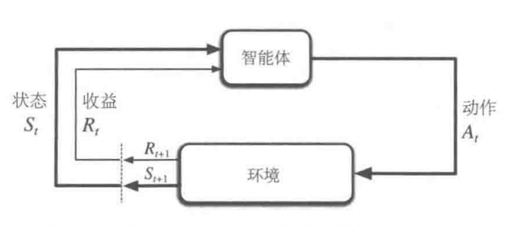

## 3.1 “智能体-环境”交互接口
这边就是我们经典的RL场景了，用一个图去表达传统RL算法：那么其实就是在时间步$t$，智能体观察到状态$S_t$，通过动作$A_t$与环境作出交互，然后环境会给出一个回报$R_{t+1}$，然后环境状态转换为$S_{t+1}$这样。那么这样与环境进行多轮交互，我们会得到一个轨迹，像这样：$$S_0,A_0,R_1,S_1,A_1,R_2,S_2,A_2,R_3,\ldots$$那么什么叫有限马尔可夫过程？
先解释有限：意思是说环境的状态、动作和收益都是有限个的。也就是说动作、状态、收益只有那么几个可能。
再解释马尔可夫过程：
意思是给定前一时刻的状态和做出的动作，下一时刻的环境状态的分布就知道了，那么公式化就是：$$p(s^{\prime},r|s,a)\doteq\Pr\{S_t=s^{\prime},R_t=r|S_{t-1}=s,A_{t-1}=a\}$$那么我们定义这个函数p，其实就是$:\mathcal{S}\times\mathcal{R}\times\mathcal{S}\times\mathcal{A}\to[0,1]$的一个映射，这个条件概率也满足如下性质：$$\sum_{s^{\prime}\in\mathcal{S}}\sum_{r\in\mathcal{R}}p(s^{\prime},r|s,a)=1,\text{对于所有}s\in\mathcal{S},a\in\mathcal{A}(s)$$这个其实没什么可说的，固定条件变量，剩下的就纯是一个概率分布了，没什么可说的。
#### 马尔可夫性
很简单，就是说我们下一时刻的奖励和状态只跟上一时刻的动作与状态有关，与再往前的无关，也有很多公式化的形式，书里没写我们也不写。
那么根据这个函数$p$，我们可以算出一些有意义的量：
1. $p(s^{\prime}\mid s,a)\doteq\Pr\{S_t=s^{\prime}\mid S_{t-1}=s,A_{t-1}=a\}=\sum_{r\in\mathcal{R}}p(s^{\prime},r|s,a)$
意思是我们把$s^{\prime}$和$r$的联合分布边缘化，也就是把$r$积分起来，就是$s^{\prime}$的边缘条件概率了。
2. $r(s,a)\doteq\mathbb{E}[R_t\mid S_{t-1}=s,A_{t-1}=a]=\sum_{r\in\mathcal{R}}r\sum_{s^{\prime}\in\mathcal{S}}p(s^{\prime},r|s,a)$
意思是说，我们定义一个“状态-动作”二元组的期望收益，也就是目前这个状态，取某一个动作一般能收到多少reward？
那么其实就是我们把$p(s^{\prime},r|s,a)$这个边缘化到$r$的概率分布上，然后得到他的分布，再求个期望就行。
3. $r(s,a,s^{\prime})\doteq\mathbb{E}[R_t\mid S_{t-1}=s,A_{t-1}=a,S_t=s^{\prime}]=\sum_{r\in\mathcal{R}}r\frac{p(s^{\prime},r|s,a)}{p(s^{\prime}|s,a)}$这个东西就是说我已知这一时刻的动作和状态，那么考虑如果下一时刻环境转移到某状态时，期望的回报是多少？
这个式子推法就是，我们首先要得到reward在给定三个条件下的的边缘分布，那么由条件概率公式就可以写成$p(r\mid s,a,s^{\prime})=\frac{p(s^{\prime},r|s,a)}{p(s^{\prime}|s,a)}$，然后就可以对$r$求期望了，至于这里的$p(s^{\prime}|s,a)$直接由公式1算出来就行了。